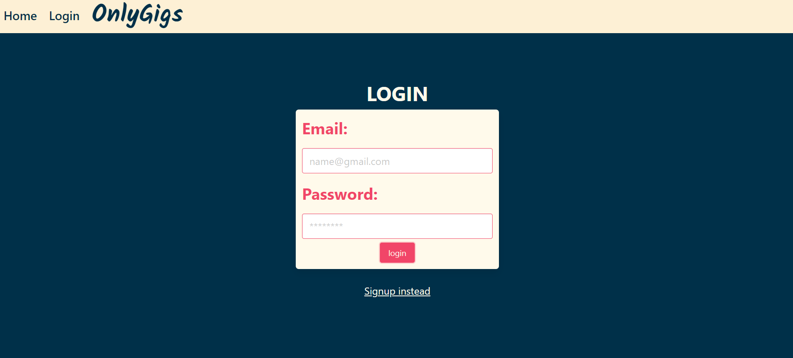

# OnlyGigs


## Description

OnlyGigs is a full-stack web application designed to streamline the process of local bands and musicians sharing their upcoming live performances with their fans and audiences. With a user-friendly interface and features, OnlyGigs aims to enhance the concert-going experience by providing a centralized platform for bands to post their gig details and for fans to easily discover and stay updated on upcoming shows.

## Link to live server
https://sheltered-inlet-74192-222de79efe22.herokuapp.com/

## Table of Contents

- [Installation](#installation)
- [Usage](#usage)
- [License](#license)
- [Credits](#credits)
- [Features](#features)

## Installation

```
npm i
```

## Usage

- Set up environment variables in a .env file
- Configure the mySQL database by running SOURCE schema.sql in the db folder
- Start the server by running node server.js
  <br>
  <br>
  [Live Link](https://sheltered-inlet-74192-222de79efe22.herokuapp.com/)
  <br>

  [Repo](https://github.com/BenWhann/OnlyGigs)



## Credits

[Brady Lange](https://github.com/BradyLange1)
<br>

[Ben Whann](https://github.com/BenWhann)
<br>

[Rylee Peterson](https://github.com/Rylee94)

## License

This application is covered by the MIT license.

## Features

- Seperate user and band sign up & login
- Different user and band interfaces
- Add a new gig
- Add comments to band page
